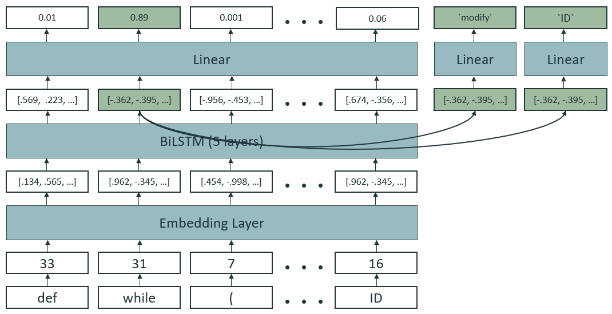

# Analyzing Software using Deep Learning - Project Summer Semester 2021

## Installation

The implementation uses `Python 3.8`. Dependencies can be installed via `pip install -r requirements.txt`.
The script [install.py](install.py) is intended for use on Google Colab. It downloads and installs conda and installs all python packages in the base environment.

## Dataset

The dataset contains 100 JSON files with 500 examples each.

```
{
    "code": "def get_pyzmq_frame_buffer(frame):\n    return frame.buffer[:]\n",
    "metadata": {
        "file": "py150_files/data/0rpc/zerorpc-python/zerorpc/events.py",
        "fix_location": 18,
        "fix_type": "delete",
        "id": 1
    },
    "correct_code": "def ID (ID ):\n    return ID .ID [:]\n",
    "wrong_code": "def ID (ID ):\n    with return ID .ID [:]\n"
}
```

The project operates on the simplified code found under "correct_code" and "wrong_code". 
Every example contains exactly 1 error, that can be fixed with 1 operation (`modify, insert, delete`) on 1 token.
In that sense, the dataset contains several assumptions that are not met in real usecases.

## Preprocessing

### Tokenization

- `tokenize` package
- Error handling needed for incorrect code: 
    - `TokenError`
        - Thrown at the end of the sequence &#8594; no tokens lost
    - `IndentationError`
        - Sometimes thrown before the end of sequence &#8594; tokens lost
        - Advantage for the model
        - Occurs only 132 times in the whole dataset (50000 samples)

### Testing Preprocessing

- Testing tokenization via reconstruction
    - Run tokenization
    - Convert character index to token index
    - Convert token index back to character index
    - &#8594; Misalignments?
- Walrus operator `:=` (fails 85 times in 50000 samples)
    - Was introduced in Python 3.8 
    - `":=="` gives `[":=", "="]` instead of `[":", "=="]`
- Decorator `@` (fails 4 times in 50000 samples)
    - `"@=="` gives `["@=", "="]` instead of `["@", "=="]`

```bash
WARNING:root:TokenError           occurred 9065    of 50000   times at ID's 8, 9, 11, 20, 36, 39, 47, 50, 58, 68...
WARNING:root:IndentationError     occurred 132     of 50000   times at ID's 428, 493, 1428, 1598, 1836, 1866, 2660, 2706, 3036, 3381...
WARNING:root:walrus               occurred 85      of 50000   times at ID's 1800, 2637, 2754, 3174, 3782, 5708, 5816, 6094, 6966, 7999...
WARNING:root:decorator            occurred 4       of 50000   times at ID's 14066, 27131, 32921, 46163
```


## Modeling & Training

### Architecture
    


### Training

- `Adam` optimizer and `CrossEntropyLoss`
- Multi-task training (adding losses together)
- Problem: As long as the location prediction is bad, the signal from type and token prediction are just irritating
- Solution: Use linear loss weighting schedule
    - decrease location loss weight
    - increase type and token loss weight

```
location_weight = torch.tensor([-(x + 1) / n_epochs + 1 
                                for x in range(n_epochs)])
type_weight     = torch.tensor([(x + 1) / n_epochs 
                                for x in range(n_epochs)])
token_weight    = torch.tensor([(x + 1) / n_epochs 
                                for x in range(n_epochs)])
```


## Results


- Use 10% of the files for testing, 90% for training
- Evaluating on test set once per epoch
    - Location Accuracy: ~97%
    - Fix Type Accuracy: ~89%
    - Fix Token Accuracy: ~89%
- Prediction
    - Fraction of corrected code snippets: ~92%