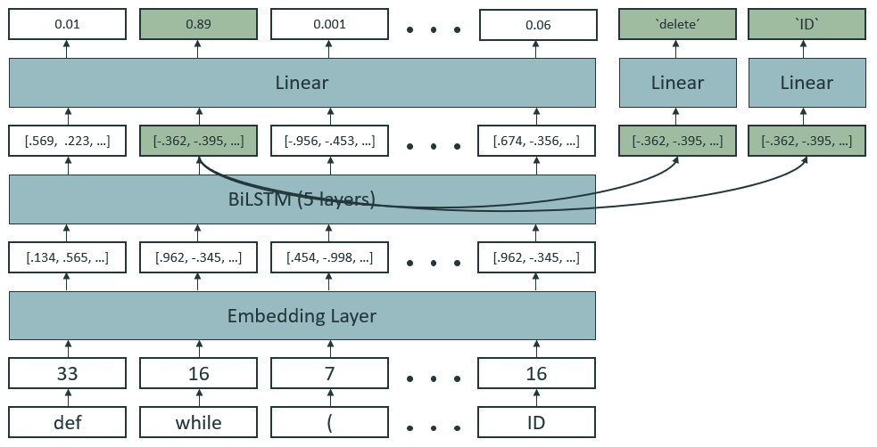

\vspace{1.5cm}
# Introduction

The provided dataset consists of 100 JSON files with 500 examples each. Each example includes a correct and an incorrect code snippet, as well as the information, how to fix that code by performing one operation on one token. In that sense, it specifies the type (insert, delete, modify), location (character index of token start) and token (replacement token) of the fix. The task is to predict the 3 paramters of each fix, given the incorrect code.

# Preprocessing

The first step in most NLP pipelines is to split the input string into tokens. This is not different for pipelines processing code of a programming language. Python provides its own tokenization in the `tokenize` package. The major challenge in the usage is, that it expects the code to be syntactically correct. The following subsections describe how this challenge was solved and how the whole tokenization procedure was tested.

Apart from the tokenization, the preprocessing implements the creation of a vocabulary by creating the set of all tokens in the training data, as well as special tokens for unknown and padding tokens. The creation is straight-forward and is therefore not further described here. The usage of the vocabulary will be briefly discussed in the Modeling section.

## Error handling

When processing incorrect code, the `tokenize` package often (not always) throws an error.
The 2 error types are `tokenize.TokenError` and `IndentationError`. 

The `tokenize.TokenError` is only thrown at the very end of the sequence (even if the causing error is in the beginning). Therefore, the error can be savely ignored and no tokens are lost.

The `IndentationError` on the other hand is sometimes thrown before the end of the sequence. That leads to some tokens of the sequence being dropped. Since the error location still is in the resulting token sequence, but the total length of that sequence is reduced, the model has an advantage with those examples. While such an advantage has to be seen critically, it occurs only $132$ times in the whole dataset of $50,000$ examples. From that follows that the largest theoretically possible advantage for the model is $\frac{132}{50000} = 0.264\%$. Considering this, the `IndentationError` can also be savely ignored.

## Testing the tokenization pipeline

In order to confirm the correctness of the tokenization, a testing mechanism is used. Firstly, it counts the number of occurences of the errors discussed in the previous subsection. Secondly it aims to reveal mistakes in the tokenization with the following procedure. 

1. Run tokenization
2. Convert character index to token index
3. Convert token index back to character index

A misalignment between the true error location and the reconstructed error location indicates, that the tokenization differs from the one used to generate the dataset. In that case, it is impossible for the model to correctly predict the fix. Using this procedure two edge cases are discovered.

1. The string `':=='` gets tokenized to `[":=", "="]` instead of `[":", "=="]`.
2. The string `'@=='` gets tokenized to `["@=", "="]` instead of `["@", "=="]`.

Both cases occur rarely throughout the dataset (85 and 4 times, respectively). The resulting disadvantage of $\frac{89}{50000} = 0.178\%$ is consciously accepted. The following shows the summary of the test for the whole dataset.

```bash
WARNING:root:TokenError           occurred 9065    of 50000   times
WARNING:root:IndentationError     occurred 132     of 50000   times
WARNING:root:walrus               occurred 85      of 50000   times
WARNING:root:decorator            occurred 4       of 50000   times
```

# Modeling

The proposed architecture is a multi-task BiLSTM. The input is a batch of token sequences, represented by their index in the vocabulary (from here on called ID). Tokens, that are not present in the vocabulary (sometimes occurs, when testing on new data) are mapped to an `UNK` token, preserved for that purpose. All sequences in a batch are padded to the max length in that batch, by appending `PAD` tokens.

The input data is passed through an embedding layer [@emb], that maps each ID to a dense representation. The embedding layer is a fully connected layer with a more comfortable API for that purpose and is fitted during training. The input embeddings are then passed through multiple layers of a BiLSTM [@lstm]. The output embeddings are then fed into a linear layer with a single output scalar, that indicates the likelihood of this particular token to be the fix location. To further classify the fix type and fix token the output representation of the predicted fix location is passed through 2 other classifiers. The figure below illustrates this data flow.

{ width=85% }

# Training

The network is trained with the `Adam` optimizer. All three training objectives use the `CrossEntropyLoss`. The individual loss terms are added together and jointly optimized. 

One problem with this setup is, that as long as the location prediction is bad, the majority of feedback signals from the type and token loss are meaningless and perhaps irritating. To mitigate this issue, a linear loss weighting schedule is introduced. Therefore the total loss consists of a weighted sum over the individual loss terms, where the weights are linearly decaying for the location loss and increasing for the type and token loss. The model smoothly transitions from predicting the location to predicting type and token.

# Results

To evaluate the models performance, the dataset is split into 10 training and 90 testing files. During training, evaluation is done on the test set once per epoch. Here, the best combination of hyperparameters achieves the following accuracies.

- Fix Location Accuracy: \tab$~97\%$
- Fix Type Accuracy: \tab\tab$~89\%$
- Fix Token Accuracy: \tab\tab$~89\%$

During final testing (running `Test.py`) the predictions are used to actually perform the fix. A light postprocessing is used to avoid spacing and indentation errors. In total, the model is able to correct more than $92\%$ of the code snippets in the test set.

# Outlook

The dataset contains the unlikely assumption, that every snippet contains exactly one error, that can be fixed with one operation on one token. Nonetheless, it represents an interesting challenge and introduction to the field of using Deep Learning to process programming languages.

For this project, the LSTM architecture was mainly chosen because the dataset is small and not too hard. Taking into account that programming languages are usually implemented using finite-state machines, it is intuitive, that even a sequentially processing model can detect and fix small syntax errors.

Beyond the scope of this dataset and its assumptions, there is very exciting and recent research about using Deep Learning to support Software Development processes (e.g. [@chen2021evaluating; @allamanis2021self; @hendrycks2021measuring; @dutta2019codenet; @lu2021codexglue]). Bigger models, that are perhaps pretrained on a large corpus of code in a self-supervised manner, might be able to predict fixes, that make the code not just syntactically but also semantically correct.

\section*{References}